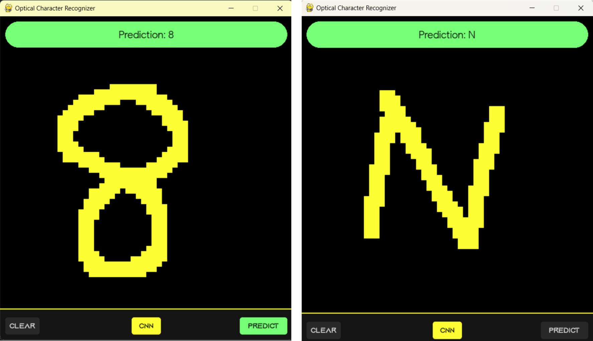
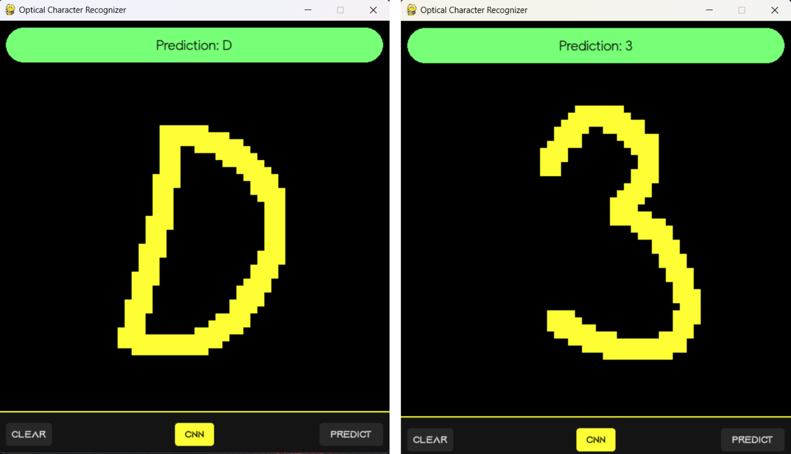
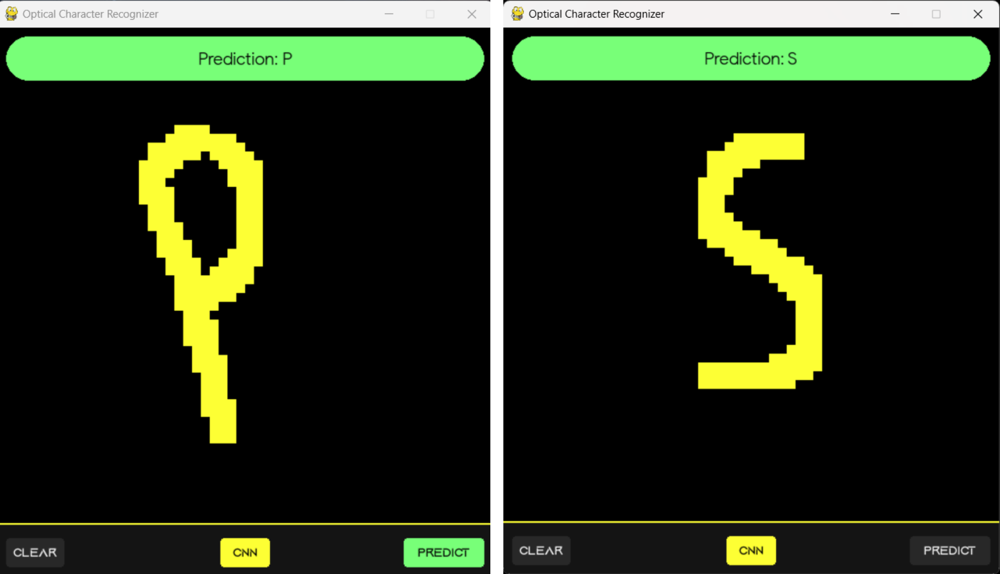

# Optical Character Recognition (OCR) using Neural Networks

#### A hand written digits and character recognizer implementing Convolutional Neural Network (CNN)

###### See also 
[3D N*N Rubik's Cube solver-AI](https://github.com/ChauhanRohan-RC/Cube.git)  
[Online Multiplayer Ping-Pong AI](https://github.com/ChauhanRohan-RC/Ping-Pong-AI.git)  
[Fourier Series Simulation](https://github.com/ChauhanRohan-RC/Fourier-Series.git)

####

####

### Overview

This program Uses a Convolutional Neural Network with the following architecture
  * Convolutional Layer 1 (32 3x3 kernels) -> ReLU, MaxPooling
  * Convolutional Layer 2 (16 3x3 kernels) -> ReLU, MaxPooling
  * Dense 1 (512 neurons)
  * Dense 2 (128 neurons)
  * Output Layer (36 neurons)
  * Tested Accuracy: 98.4 %

The model is trained on
* [MNIST digits dataset](https://www.tensorflow.org/datasets/catalog/mnist) containing 70,000 28x28 handwritten digits
* [A-Z Handwritten Alphabets](https://www.kaggle.com/datasets/sachinpatel21/az-handwritten-alphabets-in-csv-format) containing 4,20,000 28x28 handwritten alphabets

####

####

### Usage
* Clone repository `git clone https://github.com/ChauhanRohan-RC/OCR-AI.git`
* Open up the terminal and run `python main.py`

### Controls
* Mouse L-Click Drag:  Draw
* Mouse R-CLick Drag :  Erase
* Enter/Space :  Recognize drawn digit
* Escape :  Clear canvas / Quit
* S : Toggle Sound

####

####

## Connect on
[Twitter](https://twitter.com/0rc_studio)  
[Youtube](https://www.youtube.com/channel/UCmyvutGWtyBRva_jrZfyORA)  
[Google Play Store](https://play.google.com/store/apps/dev?id=7315303590538030232)  
E-mail: com.production.rc@gmail.com
